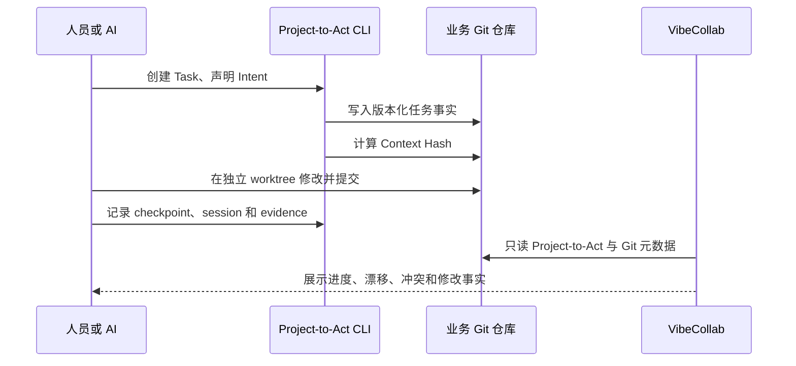

# VibeCollab 架构说明

## 1. 设计目标

VibeCollab 解决的是多人、多 AI 同时参与一个代码项目时的共识与并发控制问题。它不尝试共享一段无限增长的 AI 对话，而是把可版本化事实固化到仓库，让任何新会话都能从代码和任务文件恢复。

## 2. 分层事实源

1. `.project-to-act/PROJECT_*.md`：项目目标、功能、进度、版本和验收结论。
2. `.project-to-act/tasks/<ID>/`：单任务目标、范围、Intent、Context、状态、事件和证据。
3. 架构文档、ADR、接口 Schema 和数据库 Schema：技术契约。
4. 代码与自动化测试：实际行为。
5. PR：实现差异、验证证据和评审记录。
6. AI 对话与个人笔记：临时上下文，不是事实源。

## 3. 运行组件

| 组件       | 位置                                    | 职责                                          |
| ---------- | --------------------------------------- | --------------------------------------------- |
| 项目注册表 | `src/lib/project-registry.ts`           | 解析 allowlist，禁止 URL 传入任意文件路径     |
| 访问边界   | `src/lib/access.ts`                     | 本地开发豁免、生产令牌、Cookie 与 Bearer 检查 |
| 聚合器     | `src/lib/collaboration-monitor.ts`      | 从 Project-to-Act 和只读 Git 构建确定性读模型 |
| 契约       | `src/lib/collaboration-contracts.ts`    | 用 Zod 验证 API 与 UI 之间的数据              |
| 控制台     | `src/components/project-dashboard.tsx`  | 展示功能、任务、风险、代码进度和会话覆盖      |
| 通用 Skill | `skills/project-to-act-collaboration/`  | 安装协议、任务状态机、上下文哈希和会话接口    |
| 可选插件   | `plugins/project-to-act-collaboration/` | Codex 薄适配，不保存第二套业务规则            |

## 4. 数据流

## 5. 一致性机制

- 目标一致：所有执行端读取同一 `TASK.json`。
- 范围一致：`INTENT.json` 声明准备修改的路径、符号、公共契约和迁移。
- 上下文一致：`CONTEXT.json` 保存权威输入的 SHA-256；输入变化后任务标记 stale。
- 并发隔离：一个任务一个写入负责人、分支、worktree 和 PR。
- 契约串行：公共 Schema、迁移、认证和状态机先由唯一负责人合并。
- 结果一致：相同验收场景、契约测试、CI 和人工评审裁决所有实现。

## 6. 安全模型

- 项目根目录只能来自本机配置 allowlist。
- 只读取约定的 JSON/Markdown 事实和 Git 元数据。
- 不执行被观察仓库命令，不加载源码模块。
- API 不返回源码正文、提示、凭据或私有用户数据。
- 生产环境必须配置管理员令牌。
- 不可用数据显式降级，不将失败或未知值伪装为零。

## 7. 可扩展方向

- GitHub App 或只读 GitHub API 项目源。
- 组织、成员与项目级 RBAC。
- 跨机器 heartbeat 和耐久事件聚合服务。
- PR、required checks、CODEOWNERS 与 merge queue 投影。
- 多仓库依赖图和公共契约变更队列。
